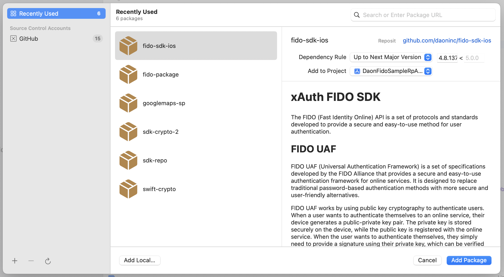

# xAuth FIDO SDK

The FIDO (Fast Identity Online) API is a set of protocols and standards developed to provide a secure and easy-to-use method for user authentication.

## FIDO UAF
FIDO UAF (Universal Authentication Framework) is a set of specifications developed by the FIDO Alliance that provides a secure and easy-to-use authentication framework for online services. It is designed to replace traditional password-based authentication methods with more secure and user-friendly alternatives.

FIDO UAF works by using public key cryptography to authenticate users. When a user wants to authenticate themselves to an online service, their device generates a public-private key pair. The private key is stored securely on the device, while the public key is registered with the online service. When the user wants to authenticate themselves, they simply need to provide a signature using their private key, which can be verified by the online service using the registered public key.

One of the key benefits of FIDO UAF is that it is resistant to phishing attacks, since the user's private key is never transmitted over the network. This means that even if an attacker is able to intercept the authentication request, they will not be able to use the user's private key to authenticate themselves to the service.

FIDO UAF also supports a wide range of authentication methods, including biometrics, PINs, and Passkeys. This allows users to choose the authentication method that works best for them, while still maintaining a high level of security.

## License
The SDK requires a license that is bound to an application identifier. This license may in turn embed licenses that are required for specific authenticators. Contact Daon Support or Sales to request a license.

## Samples

The demo sample includes the following:

- **SDK Demo**: A sample that uses the IdentityX REST API to register and authenticate a user. The sample also provides an example of how to use the JavaScript-friendly API for easier integration with React and Cordova.

## Swift Package
Add your GitHub account to Xcode and add the xAuth FIDO SDK as a Swift Package.



## API


### Initialize

Server communication can be handled by the `DaonService` framework for a quick start. However, you can write your own custom communication code by implementing the `IXUAFServiceDelegate` interface. The `DaonService` framework supports both REST and RPSA communication.

The `IXUAFRESTService` class implements the `IXUAFServiceDelegate` and is used to connect to the IdentityX server. 


```swift
fido = IXUAF(service:IXUAFRESTService(url: server, application: application, username:serverUsername))

let params = ["com.daon.sdk.ados.enabled" : "true"];

fido?.logging = true
fido?.delegate = self

fido?.initialize(parameters: params) { (code, warnings) in
        
    if code == .licenseExpired {
        self.show(title: "Initialize failed", message: "License expired")
    } else if code == .licenseNotVerified {
        self.show(title: "Initialize failed", message: "License not verified")
    } else if code == .licenseNoAuthenticators {
        self.show(title: "Initialize failed", message: "No licensed authenticators")
    } else {
        if code != .noError {
            self.show(title: "Initialize", message: "\(code.rawValue)")
        }
    }
    
    for warning in warnings {
        if warning == IXUAFWarningDeviceDebug {
            self.updateInfo(message: "Application is running in debug mode")
        } else if warning == IXUAFWarningDeviceSimulator {
            self.updateInfo(message: "Application is running in a simulator")
        } else if warning == IXUAFWarningDeviceSecurityDisabled {
            self.updateInfo(message: "Device passcode/Touch ID/Face ID is not enabled")
        } else if warning == IXUAFWarningDeviceCompromised {
            self.updateInfo(message: "Device is jailbroken")
        } else if warning == IXUAFWarningKeyMigrationFailed {
            self.updateInfo(message: "Touch ID/Face ID. One or more keys failed to migrate and has been invalidated.")
        }
    }
}


```

See included samples and [xAuth FIDO SDK Documentation](https://developer.identityx-cloud.com/client/fido/ios/) for details and additional information.

### Register 

Register a new authenticator with the FIDO server.

```swift
fido?.register(username: username) { (res, error) in
    if let e = error {
        self.show(error: e);                
    } else {
        self.show(title: "Register", response:res);
    }
}
```

See included samples and [xAuth FIDO SDK Documentation](https://developer.identityx-cloud.com/client/fido/ios/) for details and additional information.

### Authenticate

Authenticate the user with the FIDO server. If a username is provided, a step-up authentication is performed.

```swift
fido?.authenticate(username:username, description: "Login") { (res, error) in
    if let e = error {
        self.show(error: e);
    } else {
        self.show(title: "Authenticate", response:res);
    }
}
```

See included samples and [xAuth FIDO SDK Documentation](https://developer.identityx-cloud.com/client/fido/ios/) for details and additional information.


